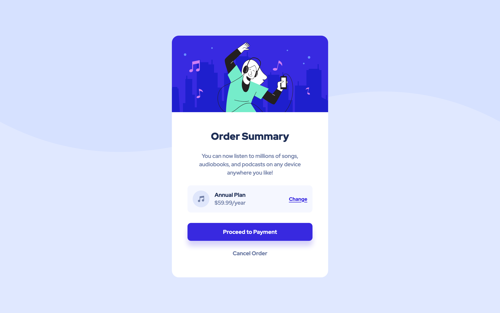

# Frontend Mentor - Order summary card solution

This is a solution to the [Order summary card challenge on Frontend Mentor](https://www.frontendmentor.io/challenges/order-summary-component-QlPmajDUj). Frontend Mentor challenges help you improve your coding skills by building realistic projects. 

## Table of contents

- [Overview](#overview)
  - [The challenge](#the-challenge)
  - [Screenshot](#screenshot)
  - [Links](#links)
- [My process](#my-process)
  - [Built with](#built-with)
  - [Continued development](#continued-development)
- [Author](#author)

## Overview

### The challenge

Users should be able to:

- See hover states for interactive elements

### Screenshot





### Links

- Solution URL: [Github](https://github.com/erelita/ordersummary_componentmain.git)
- Live Site URL: [Netlify](https://ordersummary-main-byer.netlify.app)

## My process

### Built with

- Semantic HTML5 markup
- CSS custom properties
- Flexbox
- CSS Grid
- Mobile-first workflow

### What I learned

I got a little frustrated about centering the <main> and later realized that I have forgotten to add the height on the body to center align it vertically using grid.

```html
<main> </main>
```
```css
body {
  display: grid;
  height: 100vh;
  justify-content: center;
  align-content: center;
}
```

### Continued development

I want to get familiar with grid in the future. And also javascript.

## Author

- Github - [Add your name here](https://github.com/erelita)
- Frontend Mentor - [@yourusername](https://www.frontendmentor.io/profile/erelita)
